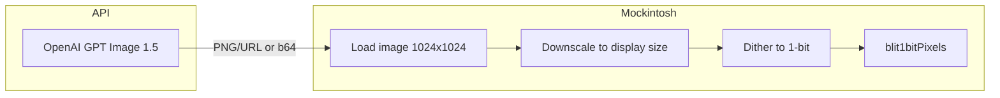

# Image generation in ChatGippity

## Approach

- **API:** OpenAI Images API with **GPT Image 1.5**, size **1024×1024**, quality **Low** ($0.009/image). No DALL·E 2; GPT Image 1.5 does not offer 256/512, so we request 1024×1024 and downscale when dithering to fit the chat window.
- **No prompt engineering:** Do not append "1-bit style", "dithered", or "high contrast" to the user's image prompt. Passing a normal prompt avoids the model drawing fake dither patterns that would conflict with our real dither and produce bad results.
- **Pipeline:** Generate normal image → load in client → dither to 1-bit at display size → blit with `ctx.blit1bitPixels`.
- **Storage:** Keep the **original** image (so we can re-dither at any display size). For now store it **in memory only** in the ChatGippity app (e.g. blob or data URL on the message object). Defer persisting to the file system (MockFS) until later.

## Constraint from the APIs

Image generation APIs return PNG/JPEG/WebP only — no 1-bit. So we **must** do the 1-bit conversion ourselves: load the image, run dither (e.g. Atkinson as in [apps/PhotoBooth.ts](apps/PhotoBooth.ts) / [apps/SpotifyPlayer.ts](apps/SpotifyPlayer.ts)), then use [AppContext.blit1bitPixels](lib/canvas/AppContext.ts) to draw into the BitCanvas.

## Pipeline (high level)

1. **Image API** — New edge function or handler calls `POST /v1/images/generations` with `model: "gpt-image-1.5"`, `size: "1024x1024"`, `quality: "low"`, returns image URL or `b64_json`.
2. **Client** — ChatGippity receives image reference, loads image (fetch URL or decode b64), draws into canvas at desired display size (e.g. fit within chat width), gets `ImageData`.
3. **Dither** — Run Atkinson (or shared util) to 1-bit `Uint8Array` at that display size.
4. **Blit** — `ctx.blit1bitPixels(pixels, w, h, x, y)` in the message area.

## Key files

- [api/chat.ts](api/chat.ts) — existing LLM proxy; image generation can be a separate route (e.g. `api/generate-image.ts`) to keep keys and responsibilities clear.
- [apps/ChatGippity.ts](apps/ChatGippity.ts) — add message type with optional image, layout for image blocks, and dither+blit when rendering.
- [apps/PhotoBooth.ts](apps/PhotoBooth.ts) / [apps/SpotifyPlayer.ts](apps/SpotifyPlayer.ts) — existing `atkinsonTo1bit`, `ditherImageFromUrl`-style flow; extract or reuse for a shared "image URL/blob → 1-bit at size W×H" helper.

## Cost (GPT Image 1.5 Low, 1024×1024)

**$0.009 per image** (OpenAI pricing as of 2025).
