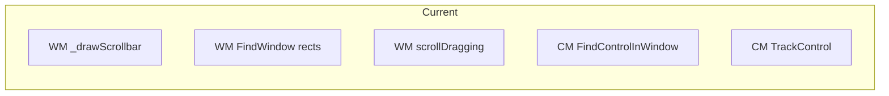
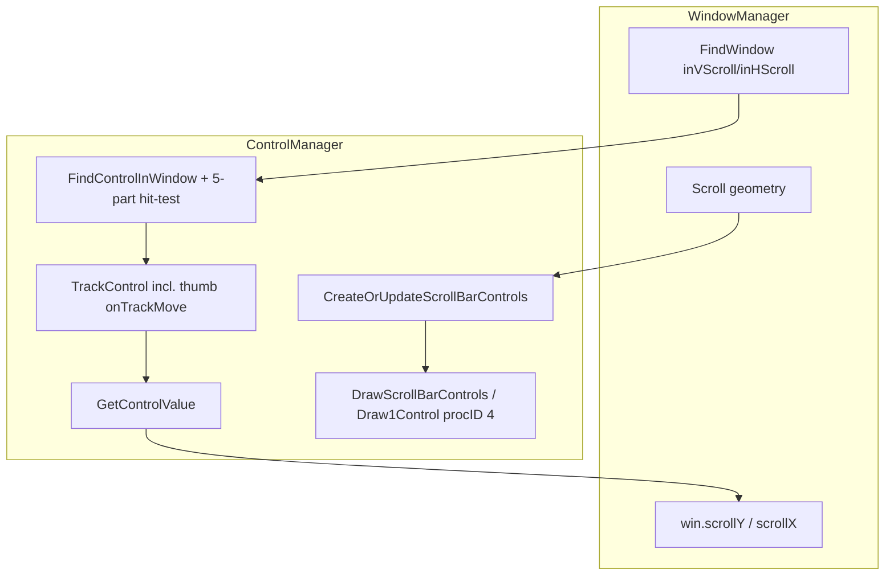

# Migrate scroll bars to ControlManager

## Current state

- **WindowManager** ([lib/toolbox/WindowManager.ts](lib/toolbox/WindowManager.ts)): owns scroll bar **geometry** (rects for inVScroll/inHScroll), **drawing** (`_drawScrollbar`, `_drawHScrollbar` — sprites, track, thumb, qdFillRect, etc.), and **control creation** (calls `NewControl(..., 4, ..., win.scrollBarControls)` with `contrlData.partCode` and `contrlAction`). It does **not** register scroll bars in `HitRegionMap`; interaction is via FindWindow → inVScroll/inHScroll → FindControlInWindow. WM also owns scroll thumb drag state (`scrollDragging`, `hScrollDragging`) and `startVScrollThumbDrag` / `startHScrollThumbDrag`.
- **ControlManager** ([lib/toolbox/ControlManager.ts](lib/toolbox/ControlManager.ts)): already provides `FindControlInWindow` (hit-test over `scrollBarControls`), `TrackControl` (works for procID 4 using `contrlData.partCode`), part codes (`inUpButton`, `inDownButton`, `inThumb`, `inPageUp`, `inPageDown`), and `NewControl` with `targetList`. It does **not** draw scroll bars: `_recordToDef` and `DrawControl` only handle button/checkbox/radio; procID 4 falls back to a dummy button def.
- **main.tsx**: on mouseDown, if `partCode === inVScroll || inHScroll`, converts to window-local, calls `FindControlInWindow`, then either starts thumb drag (WM) or `TrackControl` (ControlManager). Scroll bar **drawing** is triggered by WM's `drawWindowChrome` → `_drawScrollbar` / `_drawHScrollbar`.

## Target architecture (original Mac alignment)

- **Control Manager**: owns scroll bar controls end-to-end: creation (from bounds + scroll state), drawing (CDEF-style: vertical vs horizontal from rect), and hit-testing (FindControl / FindControlInWindow). No dependency on HitRegionMap for scroll bars; control list + FindControl is the "hit region" mechanism.
- **Window Manager**: keeps FindWindow (inVScroll/inHScroll from rect), window geometry (`_scrollableBodyHeight`, `getContentRect`, etc.), and scroll **state** on the window (`scrollY`, `scrollX`, `contentHeight`, `contentWidth`). It **delegates** scroll bar creation and drawing to ControlManager by passing computed rects and scroll state; it no longer draws scroll bar pixels or allocates scroll bar controls.
- **Thumb drag**: **Control Manager owns it** (verified against original Mac docs). On the Mac, when FindControl returns inThumb the app calls **TrackControl**; TrackControl tracks the mouse, provides visual feedback (dotted outline), and on release the CDEF updates **contrlValue**. The app then calls **GetControlValue** and performs ScrollRect/SetOrigin. So thumb tracking (mouse follow, value update, feedback) lives in Control Manager; the event loop only applies the final value to the window (e.g. set win.scrollY from GetControlValue and schedule redraw).

## Implementation plan

### 1. Scroll bar drawing in ControlManager

- Add a **ScrollBarDef** (or equivalent) to the ControlManager type set: e.g. `kind: "scrollbar"`, `boundsRect`, `vertical: boolean`, `value`, `min`, `max`, `thumbSize`, `trackSize`, and any data needed to draw arrows + track + thumb. Do **not** extend `ControlDef` with a union that forces every draw path to handle it; instead add a dedicated path for procID 4.
- Implement **scroll bar CDEF-style drawing** in ControlManager:
  - **Vertical**: up arrow (top 15px), track, down arrow (bottom 15px), thumb position from value/min/max. Use existing qdDraw helpers (or QuickDraw) and sprite access for arrows if ControlManager can receive a sprite provider; otherwise draw simple arrows/lines so ControlManager stays decoupled from ResourceManager.
- **Horizontal**: same idea (left arrow, track, right arrow, thumb).
- **Drawing entry point**: add `drawScrollBar(port, win, scrollBarBounds, vertical, value, min, max, trackLength, thumbSize)` (or a single "draw scroll bar control" that takes a small descriptor). The actual pixels today use `blitSprite`, `fillSpriteTile`, `qdFillPattern`, `qdDrawVLine`, `qdDrawRect` from WM. ControlManager currently uses `qdDraw` and QuickDraw; for sprites we have two options: (a) pass a **sprite provider** (or pre-resolved sprite IDs) into the draw function so ControlManager can blit, or (b) draw scroll bar chrome without sprites (rects + lines) in ControlManager and accept a visual change unless WM continues to draw a "background" (not recommended). Prefer (a) with a narrow interface (e.g. `getSprite(id): Sprite | null`) so ControlManager can remain the single owner of scroll bar appearance.
- **Draw1Control for procID 4**: when `contrlDefProc === 4`, do not call `_recordToDef`; instead call the new scroll bar draw routine. The ControlRecord for scroll bar **parts** (arrows, thumb) currently stores `contrlData: { partCode }`. For **drawing**, we need the **aggregate** scroll bar state (value, min, max, track size, thumb size). So either:
  - **Option A**: One ControlRecord per **scroll bar** (vertical and horizontal), with `contrlData` holding `{ partCode, vertical, trackLength, thumbSize }` and value/min/max in the record; FindControl for that control would do a **hit-test** that returns which of the five parts was hit (inUpButton, inDownButton, inThumb, inPageUp, inPageDown). That matches the Mac "one control, five parts" model and simplifies drawing (one draw call per scroll bar).
  - **Option B**: Keep multiple ControlRecords per scroll bar (one per part) as today. Then "drawing" for procID 4 is **per-part**: arrow controls draw an arrow, thumb control draws the thumb. That requires the draw routine to know the scroll bar's value/min/max/track to place the thumb; those could live on a "parent" or on the window. Option B is what we have today; the downside is WM has to create many controls and pass state for the thumb rect.

Recommendation: **Option A** (one control per scroll bar, part-code hit-test inside ControlManager). Then ControlManager exposes:

- `CreateScrollBarControl(win, boundsRect, vertical, value, min, max, refCon)` → ControlHandle, and stores in `win.scrollBarControls` (or unified list). The control's `contrlData` holds `{ vertical, trackLength?, thumbSize? }` or we compute those in the draw/hit path from bounds and value/min/max.
- **FindControlInWindow** (or a unified FindControl that includes scrollBarControls): for scroll bar controls, **hit-test the five parts** (up arrow, down arrow, track above thumb, thumb, track below thumb) and return the appropriate part code. Rect math for the five regions can live in ControlManager.
- **Draw1Control** for procID 4: given the control's rect, value, min, max, and optional sprite getter, draw the full scroll bar (arrows + track + thumb).

This implies we **reduce** the number of controls per window: two scroll bar controls (vertical + horizontal) instead of six+ (up, down, thumb, left, right, thumb). Creation moves from WM (which currently creates up to 6 controls per frame in drawScrollbar/drawHScrollbar) to a single "ensure scroll bar controls" call that creates or updates 2 controls.

### 2. Scroll bar control creation and update

- Add in ControlManager something like:
  - `CreateOrUpdateScrollBarControls(win, options)`: `options` includes vertical bounds (rect), horizontal bounds (rect), `scrollY`, `scrollX`, `contentHeight`, `contentWidth`, `scrollableBodyHeight`, `contentW` (width of content area), and optionally `scheduleRender` or `contrlAction` callbacks. This function creates or updates **two** controls (vertical and horizontal) in `win.scrollBarControls`, sets value/min/max from the window's scroll state, and sets `contrlAction` so that when the user clicks a part, the action updates the window's scroll (or invokes a callback). ControlManager will need read/write access to scroll state: either receive callbacks (`getScrollY`, `setScrollY`, etc.) or the window record reference so it can read `win.scrollY` and set `win.scrollY` (and same for scrollX). The latter is already the case for `contrlAction` today (WM sets `win.scrollY` in the callback). So ControlManager would take the window record and the same geometry inputs WM currently has; it creates the two controls and stores them in `win.scrollBarControls`.
- **Who calls CreateOrUpdateScrollBarControls?** WindowManager in `drawWindowChrome`, before drawing the scroll bars. WM computes the same rects it does today (sbx, sby, scrollableBodyH, trackTop, etc.) and passes them to ControlManager; ControlManager creates/updates the controls and then WM calls **DrawScrollBarControls(win, port)** (or UpdateControls for the scroll bar list) so that ControlManager draws them. WM no longer draws any scroll bar pixels itself.

### 3. Hit-testing (FindControlInWindow)

- **Current**: FindControlInWindow iterates `scrollBarControls` and returns the first control whose rect contains the point, with partCode from `contrlData`. With **one control per scroll bar**, the control's rect is the full scroll bar; we need to **compute part code** from the point inside that rect. Move the "which part of the scroll bar?" logic from WM (which currently encodes it in separate control rects) into ControlManager: e.g. `_scrollBarPartHitTest(control, point) → partCode` (inUpButton, inDownButton, inThumb, inPageUp, inPageDown). FindControlInWindow then calls this for scroll bar controls (procID 4) and returns that part code.
- **Page up / page down**: Today we don't expose inPageUp/inPageDown; we have only up arrow, down arrow, thumb. The original Mac had five parts; we can add page-up/page-down (click in track above/below thumb) in this migration or leave for a follow-up. The plan should include "optionally support inPageUp/inPageDown in hit-test and contrlAction."

### 4. Thumb tracking (in Control Manager)

- **Original Mac**: FindControl returns inThumb → app calls **TrackControl**. TrackControl tracks the mouse, shows a dotted outline (ghost) of the scroll box, and on release the CDEF updates **contrlValue**. The app then calls **GetControlValue** and does ScrollRect/SetOrigin. So tracking and value update are in the Control Manager; the app only reads the value and scrolls content.
- **Implementation**: Move thumb tracking into ControlManager so that when the event loop calls **TrackControl** for a scroll bar control with partCode inThumb:
  - **TrackControl** (or a scroll-bar-specific path) enters "thumb drag" mode: it must receive **mouse move** events until mouse up (unlike buttons, which only need down/up). So the return value from TrackControl for inThumb should include an optional **onTrackMove(currentPoint)** that the event loop calls on every mouse move while the button is down.
  - On each move: ControlManager updates the control's **contrlValue** (and optionally draws a ghost or live thumb); caller schedules render so the thumb position updates.
  - On mouse up: event loop calls **onTrackEnd(upPoint)**; ControlManager finalizes contrlValue and returns part code. Event loop then calls **GetControlValue**(theControl), sets **win.scrollY** or **win.scrollX** from it (scroll state remains on the window), and schedules render. No WM thumb-drag state.
- **WindowManager**: Remove **scrollDragging**, **hScrollDragging**, **startVScrollThumbDrag**, and **startHScrollThumbDrag**. WM no longer participates in thumb tracking; it only holds scroll state (win.scrollY, win.scrollX) which the event loop updates from GetControlValue after TrackControl returns.
- **main.tsx**: For inVScroll/inHScroll, always use **FindControlInWindow** then **TrackControl** (including when partCode === inThumb). Store control tracking state; on **mouse move** while tracking, if the control is a scroll bar thumb (procID 4 and partCode inThumb), call the **onTrackMove** callback from TrackControl so ControlManager can update the value and request redraw. On **mouse up**, call onTrackEnd; if the control was a scroll bar, call GetControlValue and set win.scrollY/win.scrollX from it, then scheduleRender.

### 5. WindowManager changes

- **Remove** `_drawScrollbar` and `_drawHScrollbar` implementations (all drawing and control creation).
- **Remove** scroll thumb drag state and helpers: `scrollDragging`, `hScrollDragging`, `startVScrollThumbDrag`, `startHScrollThumbDrag`, and any mouseMove/mouseUp logic that updates `win.scrollY`/`win.scrollX` during thumb drag. Thumb tracking is handled by ControlManager; the event loop updates win.scrollY/scrollX from GetControlValue after TrackControl returns.
- In `drawWindowChrome`, when `win.scrollable`:
  - Compute scroll bar geometry (same as today: headerH, scrollableBodyH, inset, sbx, sby, track extents, content height/width, etc.).
  - Call ControlManager: `CreateOrUpdateScrollBarControls(win, { verticalRect, horizontalRect, scrollY, scrollX, contentHeight, contentWidth, scrollableBodyH, contentW, scheduleRender: callbacks.scheduleRender })` (or equivalent).
  - Call ControlManager to draw: e.g. `DrawScrollBarControls(win, port)` which draws all controls in `win.scrollBarControls` using the new scroll bar draw routine (frame port so that window-local coords match).
- **Ensure** the port used for drawing scroll bars is the **frame port** (window-local origin), as today, so that control rects (window-local) match the draw coordinates. WM already uses `record.framePort` for TrackControl for scroll bars; the same port should be used for DrawScrollBarControls.
- **Do not** register any hit regions for scroll bars; FindWindow (inVScroll/inHScroll) + FindControlInWindow remains the only path. So no change to hit region registration in WM for scroll bars (WM already doesn't add hit regions for them).

### 6. ControlManager API surface

- **New types**: `ScrollBarOptions` (or similar) for creation; optionally `ScrollBarDef` for the draw path if we use a def-based API.
- **New functions**:
  - `CreateOrUpdateScrollBarControls(win, options)`: creates/updates the two scroll bar controls, sets value/min/max and contrlAction.
  - `DrawScrollBarControls(win, port)` or integrate into `UpdateControls` by having WM pass `updateRect` and the scroll bar controls list (e.g. `UpdateControls(win, port, updateRect, { controlList: win.scrollBarControls })`). Prefer a dedicated `DrawScrollBarControls(win, port)` that iterates `win.scrollBarControls` and calls the scroll bar draw for each, so that we don't mix content controlList with scrollBarControls in UpdateControls unless we unify the lists.
- **Modified**: `FindControlInWindow` — for controls with procID 4, use the new part hit-test (five parts per scroll bar) instead of reading partCode from contrlData.
- **Modified**: `Draw1Control` (or a separate path): when `contrlDefProc === 4`, call the new scroll bar drawing routine with the control's rect, value, min, max, and optional sprite getter. ControlManager will need a way to get sprites (chrome/up, chrome/down, scrollbar-bg, etc.); inject a `getSprite(id): Sprite | null` from the caller (WM or main) when calling DrawScrollBarControls, or pass ResourceManager into ControlManager for this draw path only.

### 7. main.tsx

- **Unified scroll bar handling**: For inVScroll/inHScroll, always take the same path: `FindControlInWindow(win, localPt)` → **TrackControl**(fc.theControl, localPt, port). Do **not** branch on inThumb to call WM's startVScrollThumbDrag; thumb is just another part. TrackControl for scroll bar thumb returns an object that includes **onTrackMove**(point) so the event loop can feed mouse move events during drag.
- **Mouse move**: While `controlTracking` is set and the control is a scroll bar (procID 4), on each **mouse move** convert the point to window-local and call `controlTracking.onTrackMove?.(localPt)` if present; then scheduleRender so the thumb position updates live.
- **Mouse up**: Call `onTrackEnd(localPt)` as today. If the control is a scroll bar (procID 4), after onTrackEnd call **GetControlValue**(theControl) and set **win.scrollY** or **win.scrollX** (depending on vertical vs horizontal from contrlData) from the returned value; then scheduleRender. Remove all calls to windowManager.startVScrollThumbDrag / startHScrollThumbDrag and the logic that updated scroll during drag from WM's mouseMove.

### 8. Unifying control lists (optional, follow-up)

- On the original Mac, the window has a **single control list** including scroll bars. We could merge `scrollBarControls` into `controlList` and have `FindControl(thePoint, theWindow)` search both content controls and scroll bar controls (or a single list). Then FindWindow could return **inContent** for the entire frame (including scroll bar area) and the event loop would always use FindControl for any control hit. This would allow removing inVScroll/inHScroll from FindWindow and moving the "is the point in the scroll bar area?" entirely into ControlManager. **Recommend doing this in a second phase** after the migration above is stable, to avoid changing FindWindow and the event loop in one step.

### 9. Dependencies and layering

- ControlManager today does not depend on WindowManager. It should not depend on WM after the migration either. Scroll state (value, min, max) and geometry (rects) are passed in by the caller (WM). ControlManager may depend on a small **sprite** abstraction (e.g. `(id: string) => Sprite | null`) to draw scroll bar chrome; that can be injected when drawing so that ControlManager stays in `lib/toolbox` and the sprite implementation stays in `lib/canvas` or WM.
- WindowManager continues to depend on ControlManager (NewControl, FindControlInWindow, and the new CreateOrUpdateScrollBarControls and DrawScrollBarControls).

### 10. Files to touch

| File | Changes |
|------|--------|
| [lib/toolbox/ControlManager.ts](lib/toolbox/ControlManager.ts) | Add scroll bar control type (procID 4); scroll bar creation (CreateOrUpdateScrollBarControls); scroll bar drawing (draw routine for procID 4, DrawScrollBarControls); FindControlInWindow part-code logic (five-part hit-test); **TrackControl for inThumb**: support onTrackMove so event loop can feed mouse move during thumb drag, and update contrlValue during drag; optional sprite getter for drawing. |
| [lib/toolbox/WindowManager.ts](lib/toolbox/WindowManager.ts) | Remove _drawScrollbar and _drawHScrollbar; remove scrollDragging, hScrollDragging, startVScrollThumbDrag, startHScrollThumbDrag and related mouseMove/mouseUp scroll updates; in drawWindowChrome call ControlManager to create/update and draw scroll bar controls; keep FindWindow inVScroll/inHScroll. |
| [src/main.tsx](src/main.tsx) | For inVScroll/inHScroll use TrackControl for all parts (including inThumb); on mouse move while tracking a scroll bar thumb, call onTrackMove(localPt) and scheduleRender; on mouse up for scroll bar, set win.scrollY/scrollX from GetControlValue. Remove startVScrollThumbDrag/startHScrollThumbDrag and WM-based thumb drag handling. |
| [docs/control-manager-migration.md](docs/control-manager-migration.md) or [docs/future-migrations.md](docs/future-migrations.md) | Update to state that scroll bars are now fully in ControlManager; Phase 7 (scroll bars as controls) done. |

### 11. Testing

- Manual: scrollable windows (Safari, Picture, Finder, AppStore, todo-list, etc.): vertical and horizontal scroll bars draw correctly; click up/down/left/right arrows scrolls; drag thumb scrolls; thumb position reflects scroll position.
- No new unit tests required for the plan; recommend a quick manual pass on 2–3 scrollable apps.

---

## Summary diagram

**After migration:**

Scroll bar **pixels**, **control records**, and **thumb tracking** (TrackControl + value update) are in ControlManager. **Scroll state** (win.scrollY/scrollX) stays on the window; the event loop updates it from **GetControlValue** after TrackControl returns.
