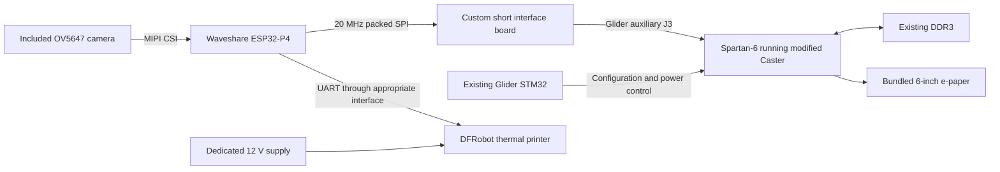

# Mockintosh e-paper prototype: engineering review and budgetary quotation

Reference MK-EPD-PROT-001, revision A, 9 September 2026.

**Recommendation:** build a P4-to-Caster bench demonstration using a Modos 6-inch kit, a Waveshare P4 camera kit, and a small custom interface board. Retain Glider's FPGA, DDR3 and panel power system. Do not commission the integrated product PCB or a new FPGA family yet.

This is a source-based engineering review and non-binding budget estimate, not a contractor offer or measured hardware result. No purchases, synthesis, physical continuity checks or optical tests have been performed. Advertised prices were checked on the date above; stock is not reserved. The proposed signal assignments require verification against the delivered board revision before connection.

## 1. Architecture decision

The first demonstration uses the **bundled 1448×1072 display**, not an unsourced 1024×758 substitute. Render 512×346 at integer 2× scaling: 1024×692 active pixels, centered with 212-pixel left/right and 190-pixel top/bottom margins. This proves the transport and controller architecture. It does not establish the appearance, cost or optical performance of the eventual 1024×758 product panel.

Keep the existing STM32 for configuration, monitoring and panel power sequencing during the prototype. Removing it adds firmware and recovery work without helping the immediate experiment. It can be reconsidered for production. A new external-input mode must also prevent stock no-video/sleep logic from turning the panel off during SPI use.

The host sends 22,144 bytes/frame, or 664,320 bytes/s at 30 fps. At 20 MHz single-lane SPI the payload occupies 8.86 ms/frame; bandwidth is credible before measurement. Use 20 MHz as the target and qualify lower rates during bring-up. No HDMI generation is required on the P4. [P4 SPI documentation](https://docs.espressif.com/projects/esp-idf/en/release-v5.5/esp32p4/api-reference/peripherals/spi_master.html)

**Memory sizing must use the actual panel.** Existing 16-bit state costs 3,104,512 bytes for the bundled panel. At 75 electrical scans/s, state reads and writes alone represent 465.68 MB/s of active-pixel traffic. For the later 1024×758 panel, the corresponding figures are 1,552,384 bytes and 186.29 MB/s at 60 scans/s. These calculations exclude arbitration, refresh and other traffic; they are requirements, not measured bandwidth. The prototype retains the reference DDR interface and validates sustained operation. [Caster wrapper](https://github.com/Modos-Labs/Caster/blob/2f714ab7c217e6441c46cfd647764d9a74967aec/rtl/spartan6/top.v)

Two packed target frames need another 44,288 bytes. Do not assume these fit in spare FPGA block RAM: the existing design also consumes that resource. Budget a DDR-backed target-image path and arbitration, with line caches; accepting a simpler BRAM implementation requires a successful fit report. Keep electrical scan cadence separate from 30 fps arrival rate. Preserve per-physical-pixel state, initialization, neutral drive and clearing.

## 2. A concrete FPGA connection

Inspected Glider commit **ed94ef7fd95a42cfdcdaf5e5da1dcdd709122763**, and its pinned Caster commit **2f714ab7c217e6441c46cfd647764d9a74967aec**. The published KiCad PCB connects auxiliary **J3**, a 16-position 0.5 mm FFC connector, directly to FPGA bank 0. Its lanes are outside the 8-bit monochrome panel data path. The published bank supply is 3.3 V. J2's user signals instead terminate at the STM32, so J2 is not our direct FPGA input.

Proposed new assignments, derived from the PCB nets and FPGA symbol; these are **design assignments, not existing firmware functions**:

| Function | Glider J3 contact | Existing net | FPGA ball | Direction |
|---|---:|---|---|---|
| SPI SCLK | 12 | EPDC_D9P | E7, GCLK15 | P4 → FPGA |
| SPI MOSI | 15 | EPDC_D8P | C7 | P4 → FPGA |
| SPI CS, active low | 14 | EPDC_D8N | A7 | P4 → FPGA |
| SPI MISO/status | 9 | EPDC_D10P | A8 | FPGA → P4 |
| READY | 8 | EPDC_D10N | B8 | FPGA → P4 |
| Stream-reset request | 6 | EPDC_D11P | A9 | P4 → FPGA |
| Ground returns | 1, 4, 7, 10, 13, 16 | GND | — | Common reference |

Sources: [Glider PCB](https://github.com/Modos-Labs/Glider/blob/ed94ef7fd95a42cfdcdaf5e5da1dcdd709122763/pcb/mainboard/pcb.kicad_pcb), [FPGA schematic](https://github.com/Modos-Labs/Glider/blob/ed94ef7fd95a42cfdcdaf5e5da1dcdd709122763/pcb/mainboard/fpga_io.kicad_sch), [existing Caster constraints](https://github.com/Modos-Labs/Caster/blob/2f714ab7c217e6441c46cfd647764d9a74967aec/rtl/spartan6/constraint.ucf).

J3 must be available and populated on the supplied hardware. Confirm connector contact orientation and cable continuity, and check that the bundled adapter does not consume these lanes. Keep panel connection J6 intact. New gateware must explicitly set these pins' direction, I/O standard and unused-pin behavior before the P4 drives them. Do not load stock or unrelated FPGA bitstreams with P4 outputs enabled. Leave unused J3 signal contacts unconnected. A stream reset aborts packet handling; it must not blindly interrupt panel drive or power sequencing.

Candidate P4 GPIO assignments, checked against the manufacturer's pinout/schematic: SCLK **GPIO30**, MOSI **GPIO29**, CS **GPIO28**, MISO **GPIO31**, READY **GPIO49**, stream-reset **GPIO50**, plus ground. These avoid the documented camera I2C, codec, boot/programming and C6 SDIO connections. Connector position numbering must be taken from the delivered board's drawing; do not apply Raspberry Pi numbering merely because the board has 40 contacts. [Manufacturer pinout](https://docs.waveshare.com/ESP32-P4-WIFI6)

Commission a short adapter with ground returns, test points and provision for approximately 22–47 Ω source termination, finalized by measurement. At each transmitter, place termination near that transmitter. Prevent powered-board outputs from feeding an unpowered peer. Select P4 header pins against its actual schematic revision, avoiding camera, audio, SDIO, boot and programming connections. [Waveshare schematic](https://files.waveshare.com/wiki/ESP32-P4-WIFI6/ESP32-P4-WIFI6-datasheet.pdf)

## 3. Prototype shopping list

Prices below are advertised prices unless marked **allowance**. Shipping and taxes are excluded. Core items have exact order identities; the custom adapter and harness are build deliverables, not products already available to order.

| Qty | Exact order item | Price | Purchase note |
|---:|---|---:|---|
| 1 | [Modos 6-inch Paper Dev Kit](https://www.crowdsupply.com/modos-tech/modos-paper-monitor) | US$199 | Mainboard, 1448×1072 screen, ribbon and Mega Adapter. Listed as preorder; displayed September 4 dispatch date was already past when checked. Obtain a current dispatch commitment. |
| 1 | [Waveshare ESP32-P4-WIFI6-KIT-A, SKU 32021](https://www.waveshare.com/esp32-p4-wifi6.htm?sku=32021) | US$25.99 | Select KIT-A explicitly. Includes preheadered P4/C6 board, OV5647 camera and camera cables. No separate camera purchase. |
| 1 | [DFRobot DFR0503-EN Embedded Thermal Printer **V2.0**](https://www.dfrobot.com/product-1799.html) | US$39 | Includes power, communication and USB leads, plus receipt and label rolls. |
| 1 | [Adafruit 352, 12 V 5 A supply](https://www.adafruit.com/product/352) | US$24.95 | Dedicated printer supply, 5.5/2.1 mm plug. Needs mating harness below. |
| 1 | [StarTech PXTNB2SEU1M](https://www.startech.com/en-eu/cables/pxtnb2seu1m) | €8.19 | EU mains-to-C7 cable for the printer supply in Sweden. |
| 2 | [StarTech TBLT4MM1M, 1 m USB-C cables](https://media.startech.com/cms/pdfs/tblt4mm1m_datasheet.pdf) | US$80 combined **allowance** | One for stock DP video/data/power from a compatible host to Glider; one for P4 programming/power. Existing equivalent cables can replace these. Price/stock for this exact cable not established. |
| 1 lot | Custom J3-to-P4 interface board: two assembled copies, FFCs, termination and header wiring | US$150 **allowance** | Fabrication release follows revision and pin verification. Spare copy included. |
| 1 lot | Printer power/data interface and harness | US$60 **allowance** | Use included printer leads, suitable barrel socket, protection, strain relief and required UART voltage translation. |
| 1 | Nonconductive mounting base and panel support | US$50 **allowance** | Support fragile glass and relieve cable loads. |

The four principal USD items total **$288.94**, plus the €8.19 cord. With the listed cable/fabrication allowances, the working shopping subtotal is **$628.94 plus €8.19**, before delivery/tax. Allocate **$900 for materials and fabrication**, allowing for small parts and a possible spare $199 display kit; this is a budget envelope rather than a supplier subtotal. No currency conversion is assumed.

Candidate exact adapter components: [Hirose FH12-16S-0.5SH(55)](https://www.hirose.com/product/p/CL0586-0531-4-55) connector and **Molex 0151660167**, 16-way 0.5 mm, 102 mm same-side-contact FFC. Design the adapter's numbering to suit that cable and verify the Glider end before releasing fabrication. These are proposed BOM entries; footprint/contact compatibility is not physically checked. [Molex family drawing](https://www.molex.com/content/dam/molex/molex-dot-com/products/automated/en-us/salesdrawingpdf/151/15166/151660160_sd.pdf)

For the printer harness, a [Same Sky PJ-002AH](https://jp.sameskydevices.com/product/resource/pj-002ah.pdf) socket is a candidate 5 A PCB part; assemble it onto the protected power interface. The printer's TTL levels must be established before selecting translator parts. Do not substitute its RS232 signals onto P4 GPIO. This is an outstanding electrical qualification item, not an omitted assumption.

Optional debugger: [STLINK-V3MINIE](https://estore.st.com/en/stlink-v3minie-cpn.html), US$26.03 list, plus adapted debug harness and an additional USB cable. It debugs the STM32. Glider normally loads FPGA bitstreams through its existing USB/STM32 mechanism, so a separate Xilinx programmer is not a base purchase. [Glider flashing/build guide](https://github.com/Modos-Labs/Glider/blob/main/USAGE.md)

Assumed supplied by the engineer: an x86 Linux/ISE-compatible build workstation, a DP Alt Mode-capable source for the stock display test, oscilloscope, logic analyzer, multimeter, lab supplies and a high-frame-rate camera for optical measurements. The base demo uses host serial commands for input; a touchscreen, keyboard and mouse are not required purchases. No battery, enclosure or standalone mains adapter for the USB-powered boards is included: they operate on the bench from suitable host power. Check available USB current before bring-up.

## 4. Implementation scope and acceptance

Implement a versioned SPI packet containing dimensions, sequence number, payload length and CRC; receive into the inactive target buffer. Reject incomplete or corrupt frames, and commit only at a safe scan boundary. READY prevents overwriting a pending buffer. When congested, the P4 retains the latest unsent image instead of accumulating latency. Retain the last valid target during a host pause while allowing ongoing pixel drive to finish safely.

Generate a local raster from the latest target, expand bits for Caster's luminance input, and insert integer scaling/margins. Caster's existing control SPI remains under STM32 control. Add an STM32 external-stream mode and retain thermal/power/fault management. FPGA changes include clock-domain crossings, DDR scheduling, reset sequencing, updated timing constraints and telemetry for packet errors, missed frames and memory underruns.

P4 work includes ESP-IDF/BSP setup for the delivered silicon revision, OV5647 acquisition, native 1-bit conversion, DMA transfer and printer output. Start with ordered dithering or thresholding to establish throughput; assess Atkinson conversion separately for appearance and temporal noise. The supplied kit's documentation and live listing disagree about P4 versus P4X marking, so record the actual revision before pinning software. [Waveshare documentation](https://docs.waveshare.com/ESP32-P4-WIFI6)

Mockintosh integration is deliberately bounded: boot the selected runtime, render the desktop/text/cursor demonstration through `PlatformDisplay.present`, connect camera preview/snapshot and send a monochrome print. Input may come through a serial test harness. The checkout has a useful bitmap interface, but the inspected photo-booth path depends on browser video/canvas APIs and no complete native P4 platform was found. Runtime feasibility is an early milestone; this estimate is not a promise to port every browser-dependent app, networking feature or dynamic module loader. [Local platform interface](../src/platform/types.ts), [current photo-booth conversion](../apps/photobooth/dither.ts)

Acceptance measurements at 20–25 °C:

- Transfer and commit 30 complete logical frames/s for 10 minutes with no packet corruption, tearing or memory underruns. Report intentional dropped frames separately.
- Camera preview continues while printing a 384-dot-wide raster snapshot; no resets or stuck panel drive. Printing speed is not guaranteed by the printer's headline mechanical speed.
- Report frame submission-to-commit timing and camera-to-visible response, including median and 95th percentile. A proposed engineering target is under 50 ms for submission-to-commit under normal load; optical settling is measured separately.
- Record moving bars, scrolling text, hands/faces and fine text after motion. Compare ghosting and visible lag to the stock Modos demonstration on the same panel. User acceptance of that baseline is required before promising equivalent optical quality in the modified design.
- Exercise CRC failure, cable interruption, host reset, and stopping mid-transfer; recover without permanently driving pixels or losing the ability to reflash.
- Deliver an assembled bench unit, reproducible source and build instructions, adapter design/BOM, pin map, timing/resource reports, test data and demonstration recordings.

This is room-temperature functional proof, not temperature-range qualification or product certification.

## 5. Risk register

| Risk | Consequence | Resolution in the prototype |
|---|---|---|
| Shipped Glider differs from published J3 design | Adapter cannot connect as proposed | Photograph, identify revision, check connector/continuity first; halt this route before adapter fabrication if incompatible. Rework or another board is separately estimated. |
| Panel optical response is unsatisfactory | 30 fps transport still produces smeared or ghosted motion | Establish stock optical baseline first. Treat lack of acceptance as a stop decision, not an endless firmware task. |
| 1024×758 supply is unverified | Prototype does not yet map to production panel | Keep procurement/qualification as a separately costed option. No substituted panel is ordered on an assumed pinout. |
| DDR arbitration or FPGA resources fail timing | Missed scans and corrupted display | Keep reference memory hardware, simulate bursts/backpressure and verify timing; measure sustained operation. Do not infer fit from ingress bandwidth. |
| SPI edges, clock crossings or startup contention | Intermittent errors or hardware stress | Dedicated clock-capable FPGA pin, bounded CDC design, short routed adapter, CRC, source termination and startup checks. |
| P4 runtime or image processing exceeds budget | Preview falls behind or OS port expands | Native camera/DMA benchmark and minimal runtime boot before app work. Reject stale frame queues. Re-estimate if runtime milestone fails. |
| Camera dither changes unnecessarily between frames | Extra pixel motion and ghosting | Compare stable ordered dithering with Atkinson on actual video; lock test exposure where appropriate. |
| Printer current pulses or incompatible logic | Resets, damaged GPIO or failed prints | Dedicated supply, verified UART levels, power measurement and worst-case raster test. |
| Legacy ISE/toolchain and vendor IP | Build cannot be reproduced | Rebuild stock bitstream early on a supported x86 environment and pin versions. |
| Fast transitions/clearing behave badly on reset | Persistent drive, artifacts or panel degradation | Retain per-pixel timers and safe shutdown; test interruption and recovery explicitly. |

## 6. Budgetary quotation

Currency USD. **Planning rate: $125/hour**, chosen solely to make the estimate explicit; it is not a sourced market rate or an offer by a named contractor. Engineering is estimated effort, not a fixed-price commitment. Parts are reimbursable/quoted separately in a real agreement. Shipping, taxes and duties are excluded.

| Milestone | Deliverable | Hours | Estimate |
|---|---|---:|---:|
| M0: freeze feasibility | Board revision/connection review, procurement release, runtime selection and minimal runtime boot | 24 | $3,000 |
| M1: reference baseline | Reproducible stock build/flash and stock optical measurements | 24 | $3,000 |
| M2: physical interface | Adapter design, two assembled copies, wiring and electrical bring-up | 20 | $2,500 |
| M3: FPGA image input | SPI, buffering, memory arbitration, raster/scaler, external-input mode, simulation/timing | 80 | $10,000 |
| M4: P4 camera pipeline | Camera acquisition, native monochrome conversion and SPI DMA | 48 | $6,000 |
| M5: bounded Mockintosh demo | Desktop/render adapter, serial input and preview/snapshot integration | 40 | $5,000 |
| M6: printer | Electrical interface, snapshot raster print and concurrent-load test | 16 | $2,000 |
| M7: validation/handover | Stress/recovery tests, recordings, complete source/build/design handover | 32 | $4,000 |
| **Engineering total** | | **284** | **$35,500** |
| **Materials/fabrication budget** | Includes the $628.94 + €8.19 planned basket and reserve within a $900 envelope | | **$900** |
| **Planning subtotal** | Before shipping/tax; budget arithmetic, not currency-converted supplier invoice | | **$36,400** |
| **25% engineering contingency** | Spend only if required and agreed in a real contract | **71** | **$8,875** |
| **Funding envelope** | Rounded planning recommendation: approximately **$46,000** | | **$45,275** |

Expected engineering schedule: **8–12 working weeks after all required hardware arrives**, assuming one engineer can cover both FPGA and embedded work, with selected tasks overlapping. Procurement waiting time and a major redesign are additional. Material availability currently prevents a firm calendar delivery date.

Contract structure I recommend: make M0 a separately awarded **24-hour/$3,000 budgetary milestone**, then accept or revise the remaining estimate after the connection and runtime risks have been resolved. Each later milestone should have a reviewable deliverable and an agreed spending cap. If optical baseline M1 is unacceptable, stop before M3. Savings from an unneeded work item should remain with the customer under time-and-materials terms.

Separately estimated options, using the same assumed rate: target 1024×758 panel sourcing and initial qualification **24–48 hours ($3,000–$6,000)** plus panels/adapters, contingent on obtaining usable parts/data. A new FPGA family, integrated production board, battery/charger, enclosure, compliance testing and production fixtures require another scope and quotation. They are not hidden in the demonstration price.

Licensing inventory: Caster core CERN-OHL-P v2; Glider PCB CERN-OHL-S; firmware MIT with component exceptions; target-specific Xilinx IP has separate terms. Record the files actually reused and include editable permitted source and attribution in handover. [Caster license notes](https://github.com/Modos-Labs/Caster#license), [Glider license notes](https://github.com/Modos-Labs/Glider#license).

## Decision

The architecture is credible enough to prototype. The best cost control is preserving tested FPGA/memory/panel-power hardware while proving the small SPI input and the optical experience. Release purchases only after confirming Glider dispatch and its actual auxiliary connector; release adapter fabrication only after checking the delivered revision. This review does not yet authorize production PCB layout or establish a production unit cost.
