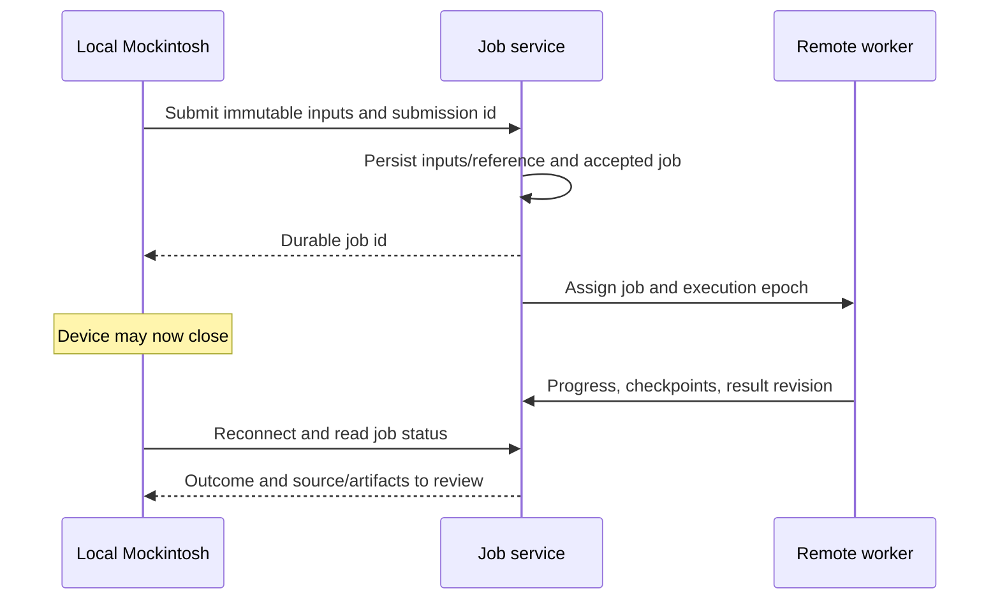
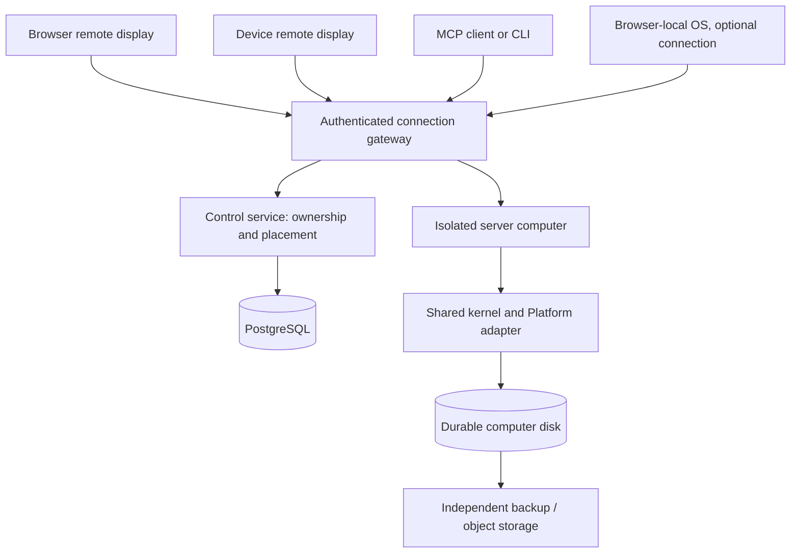

# Hosting portable Mockintosh computers

Draft, 10 September 2026. Companion to the [kernel plan](kernel-plan.md), not a claim that hosted computers exist. This document explores sync/remote-job infrastructure, optional H1 implementation, and a path to a public service. No provider has been purchased or deployed. Recommendations are judgments based on the linked primary documentation, not benchmarks. See [data-layer research](server-data-research.md) for the fuller comparison.

## Recommendation

Prioritize browser-local Mockintosh without signup, synchronized saved data, and remote jobs that continue after the device closes. A durable server computer and remote display remain an optional H1 track. If that track is selected, start with one authoritative runtime per computer and a single region. Separate ownership/identity, durable files, collaborative documents, and ephemeral desktop state; they need different consistency rules.

For the first private H1 demo, use an ordinary Linux server with a production-built Node runtime, a supervisor, and durable per-computer storage. A Hetzner VM is a reasonable candidate when we accept operating Linux ourselves; Fly Machines is the stronger candidate for an eventual service that creates and stops isolated computers on demand. Choose the public deployment only after measuring one computer's memory, active/idle CPU, startup time, and frame bandwidth. Neither choice is required by the kernel.

Use SQLite as the initial single-writer server disk candidate and PostgreSQL for hosted ownership, grants, placement, and durable action records. For a managed product, evaluate Supabase first for Postgres plus identity/storage services; choose Neon when independently selected identity and object-storage services are preferable. Keep a plain Postgres schema and an exportable disk format. Prioritize an Evolu experiment for key-owned offline data and sync, compared with the traditional baseline, before choosing the production data layer.

The user's preference for key-based identity and minimal signup is a product constraint to explore, not an instruction to require email accounts. A cryptographic owner identity can map to a Postgres row just as an email-backed identity can. Database selection does not determine the login experience.

## Remote work that survives closing the device

The preferred initial experience is local editing and rendering with remotely owned build/agent jobs. Evolu is a candidate for shared project data; a job service separately decides who executes work and records its outcome. A full hosted desktop is optional. Compilation can run in an isolated build worker; UI testing may boot a temporary headless Mockintosh against the submitted artifact.

### Ownership and acknowledgement

Submission includes an idempotency key, project/base revision, complete available input snapshot, requested work, scoped access and resource budget. Validate and retain the inputs before acceptance; do not acknowledge a job whose source exists only on a disconnected browser. The UI distinguishes “queued on this device”, “accepted remotely”, “running”, and a terminal outcome. Only accepted remote work can promise continuation after close.

The durable job service owns the record; workers claim attempts with an execution epoch. Start with one worker and add leases/fencing before multiple workers. A repeated submission id returns the same job; this does not imply exactly-once external side effects. Checkpoints and action records allow reconciliation after crashes. An old worker must not publish results after losing ownership.

A viewer disconnect stops its subscriptions, not an explicitly detached job. This is a new lifecycle contract, not a change to M1's connection-owned cancellation behavior. Cancellation is a durable request available from another authorized client; the worker acknowledges it cooperatively. Distinguish requested cancellation, stopped execution, and already-committed results. Keep CPU/time/output/storage budgets and retention policy explicit.

### Builds, agent runs, and concurrent editing

A build compiles/tests one immutable source revision. An agent run additionally needs conversation state, tool outcomes, intermediate source revisions and a checkpoint between steps. Gateway/worker credentials remain server-side; give each run access only to its project and required operations. The remote execution environment needs plaintext access to whatever encrypted data it processes.

Publish output with its base revision, resulting revision, diagnostics and artifact identity. If local source changed during execution, offer the remote result as a branch/revision to inspect or merge. Reconnecting must not overwrite unsaved edits or silently select an older build. Apply/install is distinct from job completion. A worker that finishes successfully while the client is closed records the result for later retrieval.

### Explicit handoff later

Starting remotely avoids a fragile last-second transfer. If work begins locally, “Continue on server” must checkpoint at a safe step boundary: persist the conversation, immutable source, completed action ids/results, pending work and current owner epoch. Freeze new local dispatch while transfer is pending. The server durably accepts the checkpoint and acquires ownership before resuming. If acknowledgement is lost, query ownership by transfer id before either side continues. A lost connection cannot make both sides owners.

Do not depend on tab-close hooks to upload a checkpoint. Abrupt device loss may require restarting from the last acknowledged checkpoint and inspecting uncertain actions. Arbitrary live JavaScript memory, open network calls, and tool side effects cannot be transferred simply by syncing a database.

### First deployment and acceptance

Deploy a small authenticated job API, durable job database and isolated worker; reuse the M2 builder and M3 agent-loop contracts. Evaluate an Evolu relay alongside it for selected project data, without making job ownership eventually consistent. This can precede the optional H1 remote-display deployment. Keep an offline local-only path available.

Prove acceptance followed by device closure, continued execution, server restart recovery, progress retrieval from another client and result inspection. Also interrupt submission before acceptance, duplicate a submission, revoke a worker, cancel remotely, and edit the base project locally. Verify no automatic replay of uncertain side effects and no loss of local work. Record the distinction between data synced, job accepted, job complete, and result installed.

## What exists and what H1 adds

The [Platform interface](../src/platform/types.ts) already separates display, input, scheduler, storage, and optional capabilities. The kernel already provides operation grants, a VFS, UI inspection/input and frame capture. The [headless CLI](../scripts/companion/headless.ts) proves a separate runtime can render the UI, but currently transforms code through Vite at runtime and uses an ephemeral disk. It is not a production daemon. The companion forwards requests to a paired browser; it does not run or preserve that computer.

H1 adds a production server bundle, a durable storage adapter, computer/boot identity, lifecycle supervision, and continuous remote display/input. Browser-local and device-local hosts remain independent options. A thin device display client is useful but does not establish that the device can execute Solid/JavaScript or install arbitrary apps.

## Architecture and ownership

The control service locates and starts computers; the kernel executes their operations. A browser-local OS can connect through the hosted gateway for remote tools, without moving its execution onto the server. The UI must state whether the user is viewing a local computer or a remote one. A connection loss never silently substitutes a new runtime.

| Identity | Lifetime and purpose |
| --- | --- |
| Owner/principal | Person, key holder, or delegated client; independent of identity provider |
| Computer id | Durable possession with disk and configuration |
| Boot id and writer epoch | One runtime start and authority to write; fresh on restart or restore |
| Caller session | Granted operations and paths for a selected boot |
| Display connection | Viewer/controller attachment; may reconnect without rebooting |
| Action id | Correlation and reconciliation of one operation, not permission to replay it |

Keep exactly one writable runtime per computer. For the single-host prototype, use a supervisor lock plus storage ownership checks. Before multi-host placement, implement renewable leases with fencing: stale runtimes must be unable to commit even if their network disconnects. A database row saying "running" is insufficient without enforcement at the write boundary. Immutable blobs plus a conditionally committed manifest can be a later shared-storage implementation.

Initially support many viewers and one explicit input controller. Define how an agent acquires control and how the human takes it back. Do not merge simultaneous pointer gestures. Cancel connection-owned gestures and release held input on disconnect; independently owned background work requires an explicit lifecycle contract. Idle-stop is a host policy that considers running work, not merely open sockets.

## Remote display and protocol

Start with the existing fixed monochrome resolution. The server sends an initial full framebuffer, then sequenced changed frames or rectangles; the browser scales it locally. Include computer/boot identity, dimensions, encoding, and frame sequence. On gaps or reconnect request a full frame. Bound per-client buffers and replace obsolete frame updates rather than allowing slow viewers to stall the OS.

Send ordered pointer/key/text input into the existing boot input handlers. Match keys to a connection, reject stale boots, and clear held state when control changes. Human input and semantic operations still share OS modal/focus policy. Keep operation results separate from disposable frame traffic. Avoid caching successful mutations solely in a gateway process: persistent action status is needed for reconciliation after server failure, while unknown outcomes remain possible when an external side effect cannot be atomically recorded.

Use WebSocket over TLS for the initial browser/display connection. Expose a separate remote MCP HTTP endpoint using the supported SDK/spec version; keep stdio as a local compatibility adapter. The reviewed MCP transport specifies Streamable HTTP and its HTTP authorization framework describes OAuth discovery. An API key alone is not a promise of compatibility with every MCP client's login flow. Pin the protocol version and test actual target clients before publishing setup instructions. [MCP transport](https://modelcontextprotocol.io/specification/2025-11-25/basic/transports), [MCP authorization](https://modelcontextprotocol.io/specification/2025-11-25/basic/authorization).

## Data layers and consistency

| Data | Proposed authority | Reason |
| --- | --- | --- |
| Owners, grants, API-key hashes, computers, placement | PostgreSQL for the hosted product; SQLite is enough for a private single-host prototype | Relational constraints and transactional ownership updates |
| Computer disk catalog and small file bodies | Single-writer SQLite adapter for H1, behind the existing filesystem boundary | Durable local storage without a network round-trip on every local read |
| Large binaries, build artifacts, exported snapshots | Object storage with immutable object keys and checked manifests | Avoid filling account tables with images and bundles |
| Collaborative source/text/app documents | Selected CRDT or local-first provider, scoped to documents | Offline merging is a document feature with explicit semantics |
| Windows, focus, framebuffer, held input | Live runtime | A database replica cannot reconstruct execution by merging those fields |
| Presence | Ephemeral connection state | Expiry is expected; not proof of permissions or durable ownership |

The current [FSBackend](../packages/fs/src/backend.ts) stores a complete JSON catalog and separate blobs. Replacing it with SQLite does not itself make file-plus-catalog commits atomic: calls are currently separate. H1 must either extend the persistence boundary to commit both together, or introduce versioned immutable bodies and an atomic catalog/manifest switch, with crash recovery tests. Preserve revision/CAS behavior; flush success must mean the documented durability level was reached. Do not claim multiwriter support from a database driver's transactions alone.

Backups must include catalog, referenced bytes, runtime/schema version, and checksums. Restore into a new boot and validate every reference before promotion. Restoring files does not restore unsaved app state or arbitrary JavaScript memory. Start cross-host portability with consistent disk export/import; distinguish a fork (new computer) from a move (revoke old writer). Concurrent offline boots of the same catalog are not supported until conflict semantics are designed.

### Traditional and newer choices

PostgreSQL is the conservative default for the hosted control service. SQLite is the conservative choice for a single computer's local disk. Neither automatically implements offline replication. Supabase provides real PostgreSQL with associated Auth, Storage, and Realtime services; that is useful integration, not proof that the OS is local-first. Its database backups do not contain Storage object contents, so those need their own recovery plan. [Supabase database](https://supabase.com/docs/guides/database/overview), [backup scope](https://supabase.com/docs/guides/platform/backups).

Neon's compute controls include autoscaling and scale-to-zero; evaluate its wake-up behavior against the control service's latency target, independently of whether OS runtimes stay active. [Neon compute management](https://neon.com/docs/manage/endpoints/).

Evaluate the newer systems by the experience they enable, not as interchangeable replacements for Postgres. The [research note](server-data-research.md) compares Postgres/SQLite, PowerSync, Electric, Zero, Jazz, Automerge, Yjs, Convex, InstantDB, SpacetimeDB and key-oriented alternatives. Any library integration must work with this project's Solid custom renderer and DOM-free core; a React example is not proof of compatibility. Keep vendor clients in providers/adapters, with export and migration tests.

### Key identity and the low-signup option

An appealing first-run experience is: open Mockintosh, receive a locally generated owner identity, create locally, and optionally connect another device using a recovery secret or explicit pairing. Hosted compute may be added to that identity later. Email need not be mandatory for local use or self-hosted sync.

The user identified [Evolu](https://www.evolu.dev/docs) as the service they had in mind. Its documentation describes encrypted local-first sync and a free testing relay with self-hosting as the production route. Make Evolu the first local-first candidate to prototype, preserving the traditional baseline for comparison. A free test relay is not a commitment to durable free production storage. [Evolu protocol](https://www.evolu.dev/docs/api-reference/common/local-first/Protocol), [relay hosting](https://www.evolu.dev/docs/relay).

Separate owner keys, device credentials, recovery material, and short-lived agent grants. Do not paste an owner's recovery secret into an MCP client. Prototype key loss, device revocation, sharing, and recovery before choosing a model. A public service still needs resource quotas and a way to authorize paid/invited compute; proof of a key does not stop someone creating many identities.

Encrypted relay storage and server execution have different trust boundaries. A relay can store opaque documents; a server running apps against their contents needs access to plaintext during execution. Do not advertise a server-hosted computer as opaque to its operator merely because the sync layer uses end-to-end encryption. Offer local execution plus encrypted sync as a separate mode where that property is achievable.

### Evolu experiment and deployment path

Proposed experiment: a small Mockintosh document collection with typed fields, local creation without signup, owner recovery on a second browser, offline changes, and encrypted relay sync. Mount the collection through a provider or expose it to one app; do not replace `/disk` wholesale. Evolu's Owner API distinguishes public identity, encryption keys, and write authorization, with shared and read-only owner variants. Verify the pinned release's behavior instead of designing authentication around an older mnemonic example. [Owner contracts](https://www.evolu.dev/docs/api-reference/common/local-first/Owner).

Use the free test relay only with disposable experiment data. For the next stage, build the pinned official relay source/container, inspect its storage dependencies, configure TLS and durable storage, and test backup/restore. Start on the same private VM if simplicity wins, but keep relay state separate from OS disks and credentials. Add a second failure domain only after testing multi-relay recovery. The relay documentation links the deployment source; its description as stateless does not mean that retained encrypted changes need no durable storage. [Relay source](https://github.com/evoluhq/evolu/tree/main/apps/relay).

Pass/fail gates: Solid integration without React runtime coupling; browser storage eviction/recovery; concurrent same-field updates with an understandable outcome; rich-text edits without silently replacing the other user's work; owner recovery and write-key rotation; revoked devices with old cached data; complete export without a relay; bounded history/storage growth; server access limited to an explicitly shared collection. A failure may narrow Evolu to structured personal data while a text CRDT handles collaborative source. We have not run this experiment yet.

If it passes, a simple deployment could be browser-local Mockintosh + Evolu client + our relay, with no hosted OS and no conventional signup. Add a server computer as a separately granted participant when requested. PostgreSQL remains optional for a private deployment and useful for a public service's compute ownership, quotas and placement; it need not hold decrypted personal documents.

## Hosting options

These rankings are workload-specific recommendations, not universal provider rankings. Start in one EU region near the user; benchmark from the actual clients. Prices, quotas, supported regions and plans must be rechecked when provisioning; no free-tier promise or fixed monthly quote is assumed here.

| Option | Fit for Mockintosh | Tradeoff / decision |
| --- | --- | --- |
| Hetzner Linux VM | Straightforward private prototype and self-hostable distribution | We operate patching, supervision, TLS, monitoring and recovery. Prefer this if low infrastructure cost and operational ownership matter most. Separate volume backups are required; server snapshots omit attached volumes. [Backup docs](https://docs.hetzner.com/cloud/servers/backups-snapshots/faq/) |
| Fly Machines | Strong public-service candidate for isolated computers with API-managed lifecycle | Machines and start/stop controls fit computer placement. Volume locality requires an explicit recovery/replication strategy; do not infer failover from multiple machines. [Machines](https://fly.io/docs/machines/overview/), [autostop](https://www.fly.io/docs/reference/fly-proxy-autostop-autostart/), [volumes](https://fly.io/docs/volumes/overview/) |
| Render | Convenient managed web/control service and limited trusted prototype | WebSockets are supported. Persistent disks constrain scaling and deployment: a disk-backed service is single-instance and loses zero-downtime deployment. Less natural for provisioning a separately isolated machine per user. [WebSockets](https://render.com/docs/websocket), [disk constraints](https://render.com/docs/disks) |
| Cloudflare Workers / Durable Objects | Candidate for connection coordination, presence or relay; object storage for snapshots | Durable Objects support WebSockets and hibernation, but use Workers resource limits. Hibernation does not preserve live JavaScript memory. Do not select it for the complete OS runtime without a compatibility/resource spike. [Objects](https://developers.cloudflare.com/durable-objects/concepts/what-are-durable-objects/), [WebSocket lifecycle](https://developers.cloudflare.com/durable-objects/best-practices/websockets/), [limits](https://developers.cloudflare.com/durable-objects/platform/limits/) |

For object storage, evaluate the compute provider's nearby S3-compatible service first; Cloudflare R2 is an alternative with an S3-compatible API. Measure latency and total request/storage/transfer costs, and keep recovery copies independent of the primary failure domain. [R2 documentation](https://developers.cloudflare.com/r2/).

A worker/process prevents renderer globals from colliding but is not a sufficient hostile-code sandbox. A private trusted-code demo may use one supervised process per computer. Before public app execution, use an isolation boundary appropriate for untrusted code, tightly scoped storage/network access, CPU/memory limits, and a separate build environment. Fly documents a per-user environment pattern worth validating for that deployment. [Fly per-user environments](https://www.fly.io/docs/blueprints/per-user-dev-environments/).

## Optional server-computer deployment sequence

All steps below are proposed work; these are not commands for an already-shipped server.

1. **Produce a standalone host artifact.** Compile the same universal Solid runtime in CI, pin runtime dependencies, and run it without a Vite development server. Add health/readiness and graceful shutdown. Keep provider SDKs outside the OS bundle.
2. **Run locally as a service.** Use a container image plus mounted storage, a supervisor, a localhost gateway, and one computer. Prove crash/restart durability and remote rendering before adding accounts. Provide a repeatable local setup and disk export.
3. **Deploy a private H1 instance.** Provision one Linux host and durable disk, install the immutable image, configure domain/TLS and limited access, and run the same acceptance suite remotely. Store secrets outside the image. Back up to a separate location and perform a restore to another host. Document expected downtime; this is not high availability.
4. **Add the hosted control service.** Provision managed Postgres and identity/delegation flow, computer records and grants, a remote MCP endpoint and connection routing. Use opaque per-computer storage IDs, not user-supplied host paths. Store API-key hashes, expiry/revocation and scopes. Test cross-user isolation before opening registration.
5. **Add placement and cost controls.** Implement start/stop, writer fencing, quotas and explicit idle policy using Fly Machines or a supervised VM fleet. Serialize deployments per computer; drain and checkpoint before replacing a runtime. A new image gets a new boot; never automatically replay in-flight mutations.
6. **Add collaboration only after the experiment passes.** Integrate the chosen document/sync provider without moving runtime state into it. Ship key-based ownership only with tested recovery and delegation behavior.

For a first managed public deployment, the working shortlist is Fly Machines for runtime compute plus Supabase Postgres/Auth (or key identity with a separate authorization service). This is provisional: measure fleet cost and validate networking/isolation before selecting it. For a private low-tech deployment, one Hetzner host with local SQLite and independent backups avoids requiring a managed database account at all.

## Evidence and decision gates

H1 acceptance follows the [kernel milestone](kernel-plan.md): remote human and MCP operations agree; disconnect/reconnect preserves the boot; restart preserves the computer and disk with new boot references; a second writer is rejected; local browser mode still works.

Additional infrastructure gates:

- Kill the runtime at each storage commit boundary; restart without missing referenced bodies or accepting an uncommitted revision.
- Lose the gateway during a mutation; reconcile committed/failed/unknown results without replaying a click.
- Attach a slow viewer and drop frame packets; bound memory, recover a full frame, preserve input order, and release held keys after disconnect.
- Restore a backup onto a different host; verify checksums, setting pixels and files. Record measured restore time and maximum backup loss window.
- Benchmark idle and active memory/CPU, boot latency, framebuffer bandwidth and 1/10/100-computer scenarios as capacity permits. Do not extrapolate 100 from an unmeasured single instance.
- Compare one collaborative source file and one structured app document offline on two clients, concurrent edits, reconnect, revoked access, storage exhaustion and export to plain files. Include VFS rename/delete conflicts; a convergent CRDT can still produce an invalid directory tree.

Estimate monthly cost from active computer-hours × runtime rate, idle retained resources, disk/snapshot bytes, database baseline, frame egress, requests and operational effort. Published entry prices omit important terms; decide a spending ceiling and expected concurrency before purchase.

Open decisions: choose key recovery and optional account linking; establish expected concurrent computers and idle lifetime; decide whether public generated code is enabled at launch; choose the first collaborative document experience. None blocks specifying durable job acceptance or running the local Evolu experiment; select H1 separately if a persistent remote desktop is needed.
