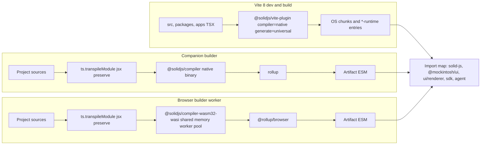

# Migrating Mockintosh to Solid 2.0

Draft, 15 September 2026. Companion to [ARCHITECTURE.md](../ARCHITECTURE.md), the [M2 app-building slice](m2-apps.md), and the [ChatGippity agent plan](chatgippity-agent-plan.md). Solid 2.0 reached Release Candidate on 12 August 2026 ([announcement](https://github.com/solidjs/solid/releases/tag/v2.0.0-rc.0), [1.x migration guide](https://v2.solidjs.com/migration/from-solid-1), [MIGRATION.md](https://github.com/solidjs/solid/blob/next/documentation/solid-2.0/MIGRATION.md)). Package facts below were read from npm on the date above (`solid-js@2.0.0-rc.8`, `@solidjs/universal@2.0.0-rc.8`, `@solidjs/compiler@2.0.0-rc.8`, `@solidjs/vite-plugin@3.0.0-next.43`, `vite@8.3.0`, `vitest@5.0.1`). RC means the API is frozen, not that it is bug-free; nothing here has been run against the OS yet.

## Decisions taken

- **Compiler: Oxc everywhere.** `@solidjs/compiler` (Rust, Oxc) compiles JSX in Vite, in the companion builder, and in the browser builder worker via `@solidjs/compiler-wasm32-wasi`. `@babel/standalone`, `babel-preset-solid`, the `assert` alias, and the Babel `define` flags leave the repo. TypeScript erasure moves to `ts.transpileModule` with `jsx: "preserve"` (the worker already loads TypeScript for typechecking). Verified: erased TSX → `transform(code, { generate: "universal", moduleName: "@mockintosh/ui/renderer" })` yields the same helper imports we emit today, plus the 2.0 changes listed below.
- **Vite 8.3 (Rolldown) and Vitest 5.** `@solidjs/vite-plugin@3` peers on Vite `^8 || ^9`, so the Vite major goes on this branch. Node 24 satisfies both. `vite-plugin-solid` is removed.
- **Cross-origin isolation is on.** The WASM compiler is a threaded napi-rs build: `new WebAssembly.Memory({ shared: true })` plus a worker pool, so the page must be `crossOriginIsolated`. `vercel.json` and `server.headers` in dev set `Cross-Origin-Opener-Policy: same-origin` and `Cross-Origin-Embedder-Policy: credentialless`. COOP `same-origin` severs `window.opener` for the Spotify popup; that flow is replaced in a follow-up (below), and Spotify login is knowingly broken on the branch until then.
- **Ship as SDK 3.** Bundles compiled against SDK 2 link against 1.x renderer helpers and cannot share a realm with 2.0. Installed SDK-2 apps are refused with a rebuild prompt; project source snapshots make rebuilding possible.
- **Migrate now, on the RC**, because the app count is small and the API is frozen; pin exact versions and expect at least one more RC bump before stable.

## Recommendation

One branch that moves the runtime, the universal renderer, both compilers, Vite, the SDK, the agent's knowledge, and the tests together. Solid 2's model — async as a property of the reactive graph, held updates, `isPending`, optimistic writes, deterministic microtask batching — fits an OS whose product is async disk, kernel traps, builds, and chat better than 1.x did. Mockintosh is the hard case Solid asks to move first: a custom `createRenderer` target, a shared import-map runtime that third-party bundles link against, an in-browser compiler that must emit the same helper calls, and an SDK that re-exports removed 1.x primitives. There is no incremental path for installed apps, only a version boundary.

Run the spikes first; they decide the shape of everything else. Do the mechanical migration before adopting the async model (Phase 5), so regressions have one cause at a time.

## What 2.0 changes that reaches us

| Area | 1.x (today) | 2.0 | Where it lands |
| --- | --- | --- | --- |
| Custom renderer | `createRenderer` from `solid-js/universal` | `createRenderer` from `@solidjs/universal`; `createElement(tag, staticProps?)`, `setProperty(node, name, value, prev?)`, `getParentNode` returns `undefined`; returns `ref`/`applyRef` instead of `use` | `packages/ui/src/renderer.ts` |
| Compiled JSX | helpers: `createElement(type)`, `setProp`, `insert`, `spread`, `use` | same names plus `_$ref(fn, el)`; static props move into `createElement("text", { font: "body" })` | every compiled bundle, all three compile sites |
| JSX types | `jsxImportSource: "solid-js"`; we augment `solid-js`'s `JSX` namespace | `solid-js` owns no JSX namespace; the renderer package ships `jsx-runtime` types | `packages/ui/src/jsx.d.ts`, both tsconfigs, `buildPolicy.compilerOptions`, 23 files importing `type JSX` |
| Stores | `solid-js/store`: `createStore`, `produce`, `unwrap`, `reconcile` | exported from `solid-js`; setters take a draft; `snapshot` replaces `unwrap`; `storePath` for old path setters | `packages/fs/src/fileSystem.ts`, `src/os/state.ts`, import map, `sharedBuildImports`, `src/runtime/store.ts` |
| Writes | synchronous | staged; visible after the microtask or `flush()`; `batch` removed | pointer/focus/TextInput, kernel UI traps, 6 test files |
| Effects | `createEffect(fn)`; `onSettled`; effect-local `onCleanup` | `createEffect(compute, apply)`; `onSettled`; cleanup returned from `apply`; writes inside owned scopes throw in dev | 36 `createEffect`, 22 `onSettled` sites |
| Control flow | `Index`, `ErrorBoundary`, `Suspense`, `Context.Provider` | `For keyed={false}`, `Errored`, `Loading`, context as component | `Window.solid.tsx`, `OSRoot.solid.tsx`, `ui.ts`, `packages/ui/src/index.ts` |
| Async | `onSettled(async …)` + signals | memos may return promises; `Loading`, `isPending`, `latest`, `refresh`, `action`, `createOptimistic(Store)` | apps, Finder, kernel clients (Phase 5) |
| Vite | 6.4, `vite-plugin-solid@2.11` + Babel preset | 8.3 on Rolldown, `@solidjs/vite-plugin@3` with `compiler: "native"` (default) | `vite.config.ts`, `scripts/builder/compiler.ts` |
| Browser builder | `@babel/standalone` (3.1 MB) + `babel-preset-solid@1.9` | `ts.transpileModule` + `@solidjs/compiler-wasm32-wasi` (5.8 MB WASM, lazily fetched; needs `crossOriginIsolated`) | `src/platform/web/builder/compiler.ts`, `vercel.json` |

## Inventory of what has to move

Counted across `src`, `packages`, `apps`, `scripts` (excluding eval output):

- `createSignal` 140, `createMemo` 61 — unchanged API; only staged-write timing matters.
- `createEffect` 36 sites in 13 files (Finder 6, TextInput 4, MacPaint 4, SpotifyPlayer 4, TextEditor 3, `windowBands` 3, …). Each becomes `createEffect(compute, apply)` or, when it derives a value, a `createMemo`. Any that write a signal inside the effect will throw in dev, which is how we find them.
- `onSettled` 22 → `onSettled`. Most are `onSettled(async () => { const x = await …; setX(x) })`; in Phase 4 they become `onSettled`, in Phase 5 most become async memos.
- `onCleanup` 25 — still exists; ones inside effects become returned cleanups.
- `produce` 10 (`src/os/state.ts` 4, `packages/fs` 1, comments) → draft setters. `unwrap` 2 → `snapshot`. `reconcile` 4 → `reconcile(value, key)(draft)`. `batch` — `FileSystem.batch()` wraps `solidBatch`; 2.0 batches by default, so it becomes a documented no-op or is removed.
- `Context.Provider` — `Window.solid.tsx` (3 nested), `OSRoot.solid.tsx`, `ui.ts` (3 nested via `createComponent`) → the context object is the component.
- `ErrorBoundary` 1 (`Window.solid.tsx`, per-window instance attribution) → `Errored`; fallback receives an accessor.
- `Index` — re-exported from `@mockintosh/ui`, no callers → drop from the export.
- `ref={…}` 2 (TextInput, TextEditor); neither registers `onCleanup` inside the callback, so the unowned-ref change is safe.
- `type JSX` imported from `solid-js` in 23 files → `import type { JSX } from "@mockintosh/ui"` or `Element` from `solid-js`.
- Solid re-exports: `@mockintosh/ui` (`createSignal … batch`, `Show, For, Index, Switch, Match`, `createStore` from `solid-js/store`) and `@mockintosh/sdk` (`createSignal … onSettled, Show, For`). The SDK change is a public contract.
- Tests touching signals or `createUI`: `packages/ui/tests/{renderer,textInput,textLayout,selectable}`, `packages/fs/tests/fileSystem.test.ts`, `src/os/kernel/uiService.test.ts`, plus `src/os/boot.test.ts` which boots the shell headless.
- Agent knowledge that teaches 1.x: `packages/sdk/docs/APP_DEV_GUIDE.md`, `src/os/projects/templates.ts` (Counter and Paint seeds), `api/mockintosh-context.ts` / `scripts/build-chat-context.ts`, `scripts/agent-eval`.
- Vite 8 config: `build.rollupOptions` → `build.rolldownOptions`; confirm `preserveEntrySignatures: "strict"` still protects the `*-runtime` entry exports (the import map depends on those names surviving); `optimizeDeps.include` loses the Babel entries and gains `@solidjs/universal`; `@rollup/browser` stays `exclude`d; the WASM package is excluded from prebundling so its worker and `.wasm` URLs resolve as assets.

## Compile pipeline after the migration

All three sites pass the same `{ generate: "universal", moduleName: "@mockintosh/ui/renderer" }` and therefore emit the same helper calls. The `toolchain` string moves from `solid-universal-v1/sdk-2` to `solid-universal-v2/sdk-3` so persisted build records are distinguishable.

## Phases

### Phase 0 — Spikes (gate for everything else)

1. **Renderer spike.** Install `solid-js@next`, `@solidjs/universal@next`, `@solidjs/compiler@next`, `@solidjs/vite-plugin@latest`, `vite@8`, `vitest@5`. Port `packages/ui/src/renderer.ts`: apply `staticProps` in `createElement`, accept `prev` in `setProperty`, return `undefined` from tree queries, export `ref`/`applyRef`, drop `use`. Configure the plugin with the existing `include` regexes and `solid: { generate: "universal", moduleName: "@mockintosh/ui/renderer" }`. Add `flush()` to `createUI` per the flush policy below. Boot the headless shell (`src/os/boot.test.ts`) and drive a menu and ⌘N. *Exit:* shell boots, menus open, one window renders, no dev-mode owned-write errors from `packages/ui` itself, `*-runtime` chunk exports intact under Rolldown.
2. **Builder spike.** Replace Babel in the worker with `ts.transpileModule` + the WASM compiler behind the existing `compile()` seam; set COOP/COEP in `server.headers`. `project_create → build_submit → app_install` Counter and click it. Verify: the loader's `new Worker(new URL('@solidjs/compiler-wasm32-wasi/wasi-worker-browser.mjs', import.meta.url))` bare specifier resolves under Vite; nested workers (our builder is already a module Worker) run in Chrome, Firefox, Safari; `.wasm` is fetched once and cached. Record compile latency against today's Babel path. *Exit:* Counter increments on 2.0 helpers through the import map; a second build reuses the instantiated compiler.
3. **Flush policy.** Staged writes mean `setX(1); x()` still reads the old value. Proposed: `flush()` at the end of `dispatchPointer` and `dispatchKeyboard`, at the start of `frame()` and `inspect()`, and at `FileSystem` mutation boundaries the kernel awaits. The kernel's `click → inspect` traps and pointer capture keep the synchronous view they assume; component code gets default batching. Confirm in the spike.
4. Record findings (owned-write sites hit, flush points needed, compile timings, COEP casualties) at the bottom of this document.

### Phase 1 — Toolchain and package boundary

- `package.json` / `packages/*/package.json`: `vite@8`, `vitest@5`, `@solidjs/vite-plugin@3`, `solid-js@2`, `@solidjs/universal@2`, `@solidjs/compiler@2` (+ `@solidjs/compiler-wasm32-wasi@2` as an explicit dependency so the browser build can import it); remove `vite-plugin-solid`, `babel-preset-solid`, `@babel/standalone`, `@types/babel__standalone`, `assert`. `@solidjs/web` arrives as a required peer of the plugin and is unused; note it in the lockfile review.
- `vite.config.ts`: plugin swap; `build.rolldownOptions` with `preserveEntrySignatures`; `optimizeDeps` rewrite; drop `define` Babel flags and the `assert` alias; `server.headers` and preview headers for COOP/COEP; build inputs drop `solid-store-runtime`; import-map plugin drops `solid-js/store`.
- `vercel.json`: `headers` for `/(.*)` with COOP `same-origin` and COEP `credentialless`; `callback.html` keeps working as a page but its `opener` handoff is dead until the follow-up.
- `index.html` dev import map: remove `solid-js/store`; delete `src/runtime/store.ts`; update `src/runtime/importmap.test.ts`.
- `src/shared/buildPolicy.ts`: `sharedBuildImports` minus `solid-js/store`; `compilerOptions.jsxImportSource` → `@mockintosh/ui`.
- `src/platform/web/builder/compiler.ts` and `scripts/builder/compiler.ts`: TS erase → Oxc → rollup; `toolchain` bumped; `vendor.d.ts` Babel declaration removed.
- Vitest 5 migration notes checked against `scripts/vitest-setup.ts` and the `test.include` list.

### Phase 2 — `@mockintosh/ui` on `@solidjs/universal`

- Renderer port from the spike, with tests in `packages/ui/tests/renderer.test.ts` asserting static props from `createElement` reach `setNodeProperty` and that `ref` fires with the `CanvasNode`.
- JSX ownership: move `jsx.d.ts` to `@mockintosh/ui/jsx-runtime` and `jsx-dev-runtime` type entries declaring `box`/`text`/`image`/`raster`/`bitmap` and `HostProps`. `tsconfig.json`, `packages/ui/tsconfig.json`, `templates/app/tsconfig.json` set `jsxImportSource: "@mockintosh/ui"`. Export `type JSX` from `@mockintosh/ui`; codemod the 23 import sites.
- `ui.ts`: contexts as components; `flush()` points; `applyAutoFocus` after the first settled frame.
- Components: TextInput, TextEditor, Button, Checkbox, ScrollView; pointer/focus assumptions about synchronous reads.
- Re-export surface: drop `batch`, `Index`, `onSettled`; add `onSettled`, `flush`, `Loading`, `Errored`, `isPending`, `latest`, `refresh`, `action`, `createOptimistic`, `createOptimisticStore`, `snapshot`, `storePath`, `merge`, `omit`; `createStore`/`reconcile` from `solid-js`.

### Phase 3 — `@mockintosh/fs`, shell state, kernel

- `fileSystem.ts`: `createStore` from `solid-js`; `produce(mutate)` → `setState(mutate)`; `unwrap` → `snapshot`; `batch()` kept as a documented no-op or removed with its test rewritten around `flush()`.
- `src/os/state.ts`: window store `produce` → draft setters; proxy reference stability is preserved by draft setters.
- `Window.solid.tsx` / `OSRoot.solid.tsx`: contexts as components; `ErrorBoundary` → `Errored` with accessor fallback; instance error attribution unchanged.
- `boot.ts`: `createRoot` per instance still valid; confirm `instances.own(dispose)` with the new owner model; frame loop flushes before `ui.frame()`.
- Kernel UI traps (`uiService.ts`): `click`/`type`/`key`/`drag` flush before returning so `inspect` and `screenshot` see the committed tree; `uiService.test.ts` updated.

### Phase 4 — Bundled apps, SDK 3, and the agent

- Mechanical pass over `apps/*` and `packages/sdk`: `onSettled` → `onSettled`, split effects, `mergeProps`/`splitProps` → `merge`/`omit`. `sdkClean.ts` and `check:core` stay the layering gates.
- `@mockintosh/sdk` 3.0.0: new re-export surface; `AppManifest.sdk` major 3; `AppStore` filter `sdkMajor >= 3`; `installedApps` refuses SDK-2 bundles with a rebuild prompt; `templates/app/package.json` peers.
- Agent knowledge: rewrite `APP_DEV_GUIDE.md` lifecycle and async sections; regenerate `templates.ts` seeds and `api/mockintosh-context.generated.ts`; add a 2.0 idioms block to `AGENT_BRIEF`; `npm run agent:eval` must pass Counter, Notes, and the drawing task on the new runtime before merge.

### Phase 5 — Adopt the async model (after the shell is green)

- Convert `onSettled(async () => setX(await read()))` to `const x = createMemo(() => read())` under `<Loading>`: ChatGippity history, Picture, FileViewer, Finder folder listings, Source Editor build status, App Store catalog.
- Window chrome reacts to `isPending`: watch cursor and dimmed title while a folder relists or a build is in flight, instead of tearing the body down.
- CAS writes as optimistic stores: Source Editor and Finder apply the draft, `yield` the trap, `refresh` the catalog; a lost `expectedRevision` drops the overlay. `action` replaces per-app `busy` flags.
- `FileSystem` exposes async iterables where effects with manual subscriptions exist today.
- Revisit `packages/agent` loop state for `action`-shaped steps once the traps settle.

### Follow-up — Spotify sign-in without `window.opener`

COOP `same-origin` makes `authorize()` in `src/platform/web/browser.ts` hang: the popup returns to `public/callback.html` with `window.opener === null`, so the `postMessage` never arrives. Replace the popup with a TV-style sign-in: the OS shows a QR code (`encodeQR` already ships in the SDK) and a short code; the user signs in on their phone; the OS polls until the token arrives. Spotify does not offer the OAuth device-authorization grant to third-party apps, so the relay is ours: `api/spotify` mints a session id, the phone completes the standard Authorization Code + PKCE flow against `/callback` on our origin, the function stores the code keyed by session, and `authorize()` polls `/api/spotify/session/:id` with backoff. The desktop path can still work with a plain same-origin popup handing off via `BroadcastChannel` (no `opener` needed), which is the cheaper intermediate if the QR flow slips. `BrowserService.authorize` keeps its signature; the web platform swaps the implementation. Not on the migration branch.

### Follow-ups, not on the branch

- `@rolldown/browser` in place of `@rollup/browser` in the worker, now that the rest of the toolchain is Rolldown.
- `@solidjs/signals` as the dependency of `packages/fs` and the DOM-free core instead of `solid-js`, if its export surface covers what they use.
- Audit `loadScript` (Spotify Web Playback SDK) and external `<video src>` under COEP `credentialless`; decide per feature whether to proxy through our origin.

## Risks

- **RC churn.** rc.0 → rc.8 in five weeks. Pin exact versions; expect another bump before stable.
- **Two majors at once.** Vite 8's Rolldown changes CJS interop and drops some Rollup options; the Solid runtime changes semantics. Land Phase 1 with the *old* Solid runtime compiling under Vite 8 first (one commit), then swap Solid, so bisecting stays possible.
- **Cross-origin isolation blast radius.** COEP `credentialless` blocks or de-credentials every cross-origin subresource without CORP: Spotify's playback SDK script and iframe, external video, images the Safari app loads. Safari's `credentialless` support is recent. Spotify login is broken on the branch by design until the follow-up; other casualties are recorded in the spike findings.
- **WASM loader under Vite.** Bare-specifier worker URLs and nested workers are the two places the napi-rs loader may not survive bundling; if they fail, the fallback is copying `wasi-worker-browser.mjs` and the `.wasm` into `public/` and pointing the loader at absolute URLs.
- **Dev-mode diagnostics as forcing function.** Owned-scope writes throw and top-level reactive reads warn only in development; run tests and the browser in dev mode throughout.
- **Staged writes in input handling.** Pointer capture, double-click detection, focus traversal, and TextInput selection read state they just wrote. The flush policy covers boundaries; interior cases surface as one-frame-late behaviour. Add a headless test that clicks, types, and inspects in one tick.
- **Installed apps.** Every SDK-2 bundle stops working at the version boundary; refusal must be explicit and offer rebuild.
- **Agent regression.** ChatGippity writes 1.x code until its context is regenerated; land knowledge changes in the same PR, gated by `agent:eval`.
- **Payload.** 5.8 MB WASM replaces 3.1 MB Babel in the lazily loaded compiler; it must stay out of the initial desktop load and be cached by the service layer. Confirm the production `solid-runtime` chunk stays comparable to today.

## Verification

1. `npm run typecheck` (all three tsconfigs) with `jsxImportSource: "@mockintosh/ui"`; zero `solid-js/store`, `solid-js/universal`, `onSettled`, `batch`, `produce`, `unwrap`, `Index`, `ErrorBoundary`, `.Provider`, `@babel/standalone`, `babel-preset-solid` in source (grep test beside `sdkClean`).
2. `npm test` green on Vitest 5 in development mode with explicit `flush()` points; `boot.test.ts` drives menus, ⌘N, dialog, click → inspect in one tick.
3. Browser (Chrome, Firefox, Safari): `crossOriginIsolated === true`; boot, Finder folder, MacPaint stroke, TextInput selection and paste, ChatGippity round trip, `project_create → build_submit → app_install → app_restart` for Counter and Paint with the WASM compiler, installed SDK-2 app refused with a rebuild prompt.
4. Companion: `npm run test:m1`, `test:browser-build`, MCP `render`/`screenshot` after `click`; native `@solidjs/compiler` output byte-identical to the browser worker for the same project.
5. `npm run agent:eval` passes on the regenerated context.
6. Production build under Rolldown: `*-runtime` entry export names intact; import map lists `solid-js`, `@mockintosh/ui`, `@mockintosh/ui/renderer`, `@mockintosh/sdk`, `@mockintosh/agent` and nothing else; WASM asset absent from the initial load; response headers carry COOP/COEP.

## Spike findings

Phase 0 ran as the first commits of this migration, not as a throwaway branch.

- `@solidjs/universal@2.0.0-rc.8` `createRenderer` accepts `createElement(tag, staticProps)` and `setProperty(..., prev)`; tree queries return `undefined`. Compiled output emits `_$ref`. Static props must be applied in `createElement` or they vanish.
- `@solidjs/vite-plugin@3` with `compiler: "native"` (default) and `solid: { generate: "universal", moduleName: "@mockintosh/ui/renderer" }` compiles the OS on Vite 8.3 / Rolldown. `preserveEntrySignatures: "strict"` stays on `build.rolldownOptions`.
- Browser worker: `ts.transpileModule` (`jsx: "preserve"`) then `@solidjs/compiler-wasm32-wasi` `transform()`. The page is cross-origin isolated (`COOP: same-origin`, `COEP: credentialless`) so the threaded WASM loader can use shared memory.
- `flush()` at `inspect` / `frame` / pointer / keyboard keeps kernel `click → inspect` and TextInput tests synchronous.
- Spotify `window.opener` is dead under COOP; `authorize()` and `callback.html` now also use `BroadcastChannel("mockintosh-authorize")`. The in-app QR device flow remains.
